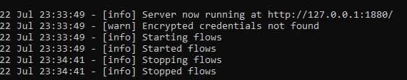
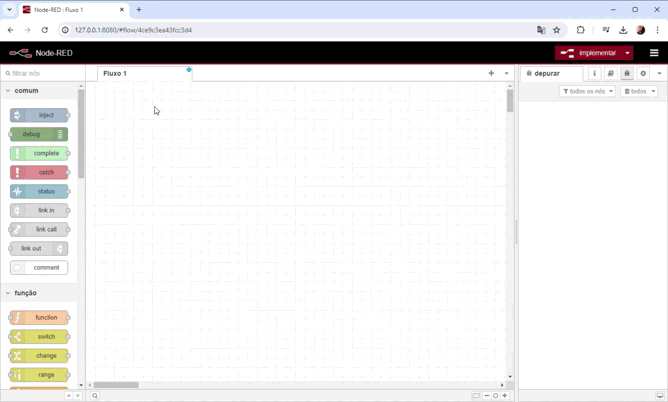

# Nesse primeiro commit irei contextualizar o uso do Node Red e como instalar em sua máquina

O Node-RED é uma ferramenta de programação visual desenvolvida pela IBM, projetada para simplificar o processo de criação de aplicações. Ele permite aos usuários criar fluxos de trabalho conectando diversos componentes através de uma interface gráfica intuitiva, ao invés de escrever código manualmente. Essa abordagem é especialmente útil para integrar e automatizar sistemas e serviços de forma rápida e acessível.

A principal característica do Node-RED é ser LOW-CODE.

# Instalação
Feito o contexto do node red. Iremos para a instalção, que tem como pre-requisito ter o nodejs instalado na sua máquina.
## 1° Passo vá para esse link e 
[Node-RED Getting Started](https://nodered.org/docs/getting-started/)
Após entrar no site, selecione a opção contornada em vermelho (Running Locally);
[Clicável](./src/1.png)

# 2° Selecionando máquina windows
Logo isso, selecione a versão windows do node-red, por ser a versão que estarei utilizando.
[Windows](./src/2.png)

# 3° Instalando o node -red na sua máquina
Abra o cmd e execute o seguinte comando: npm install -g --unsafe-perm node-red

# 4° Executando 
Após a instalação no cmd digite:
    1. node-red -> Isso irá começar a inicialização e te dará o server para começar a desenvolver
    ;

2. Cole esse server no seu navegador e você será redirecionado para essa tela.

# 5° Executando seu primeiro comando

